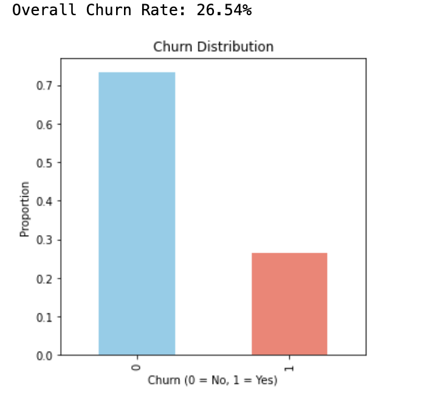
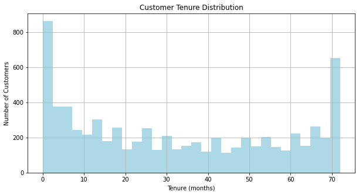
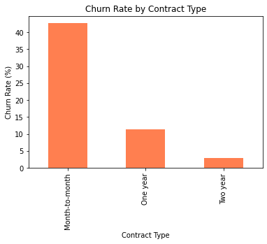
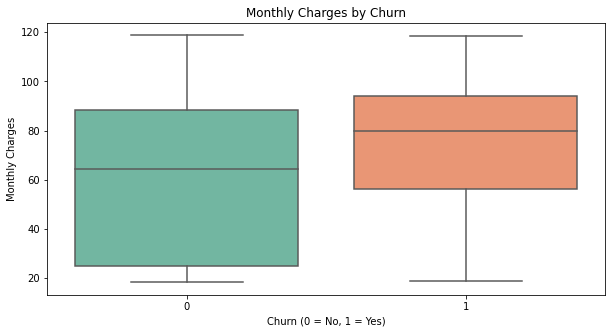
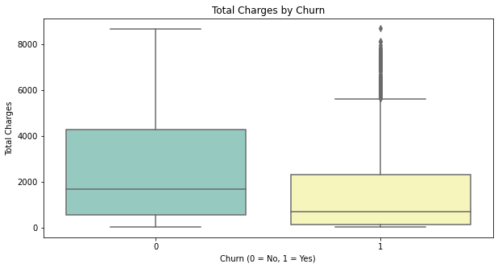

# Customer Churn Analysis for a Telecom Company

## Objective
This project aims to analyze customer churn patterns in a telecom company and provide actionable insights for reducing churn and improving customer retention.

## Dataset
- **Source**: [Kaggle - Telco Customer Churn Dataset](https://www.kaggle.com/datasets/blastchar/telco-customer-churn)
- **Description**: This dataset includes customer demographic and service usage information, with a label indicating whether each customer churned.

## Tools & Skills
- **Tools Used**: Python (Pandas, Matplotlib, Seaborn)
- **Skills Demonstrated**: Data Cleaning, Exploratory Data Analysis, Data Visualization

### Analysis Summary

1. **Overall Churn Rate**
   - **Insight**: The churn rate in the dataset is around 26.54%, indicating that a significant number of customers are leaving. This can be a potential revenue loss if not addressed.
   - **Actionable Suggestion**: Investigate further into customer satisfaction factors and review the effectiveness of retention strategies.

2. **Tenure Distribution**
   - **Insight**: The majority of churn occurs among customers with shorter tenures. Lower retention among new customers may point to issues in the onboarding process.
   - **Actionable Suggestion**: Improve initial engagement strategies to ensure new customers are satisfied and see the value in staying longer.

3. **Churn by Contract Type**
   - **Insight**: Customers with month-to-month contracts have a higher churn rate, whereas those on longer contracts (one-year or two-year) are less likely to churn.
   - **Actionable Suggestion**: Offer incentives for longer contract commitments, such as discounts, to encourage customers to stay.

4. **Monthly Charges and Total Charges by Churn**
   - **Insight**: Higher monthly charges are associated with a higher churn rate, suggesting a potential dissatisfaction with pricing.
   - **Actionable Suggestion**: Introduce value-oriented plans or discounts for high-spending customers to reduce churn.

5. **Churn by Gender**
   - **Insight**: Churn rates are fairly consistent across genders, implying gender is not a strong factor in churn.
   - **Actionable Suggestion**: Focus retention efforts on other influential factors, such as contract type and monthly charges.

6. **Churn by Senior Citizen Status**
   - **Insight**: Senior citizens have a higher churn rate, possibly due to specific needs or challenges they face with the service.
   - **Actionable Suggestion**: Consider specialized customer support or tailored services for senior customers to improve their retention.

### Visualizations

Here are the key visualizations from the analysis:
  - **Churn Distribution**

  

- **Tenure Histogram**
- 
  

- **Churn Rate by Contract Type**
- 
  

- **Monthly Charges by Churn**
- 
  

- **Total Charges by Churn**
- 
  

  

## Conclusion
This analysis highlights key factors influencing churn, such as contract type and monthly charges. Implementing these insights could improve customer retention rates.

